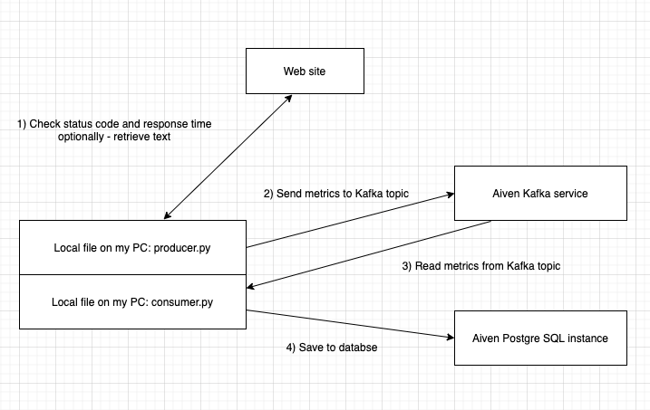

# Documentation



## Installation for usage

- _Note: for security reasons all settings like password, host adress, etc. are accessed through environmental variables. Please activate them using `setenv.sh` - I will send it by e-mail._

```
python3 -m venv venv
source venv/bin/activate
pip install git+https://github.com/al31415/assignment-kafka-postgresql
```

download example files 

```
wget https://github.com/al31415/assignment-kafka-postgresql/raw/master/src/lib/examples/run_producer.py
wget https://github.com/al31415/assignment-kafka-postgresql/raw/master/src/lib/examples/run_consumer.py
```

set environmental variables

```
source setenv.sh
```

run producer and consumer

```
python3 run_producer.py https://news.ycombinator.com/ --sleep_interval 1
python3 run_consumer.py --sleep_interval 1
```


check out what is written into PostgreSQL

```
python3 -c "from lib import request_db; print(request_db('select * from metrics;'))" 
```


## Installation for development / testing / debugging

In order to run tests repository should be cloned and editable installation should be done.

```
git clone https://github.com/al31415/assignment-kafka-postgresql.git
cd assignment-kafka-postgresql
python3 -m venv venv
source venv/bin/activate
pip3 install -r requirements.txt
pip install -e .
```

Run tests

```
pytest
```

